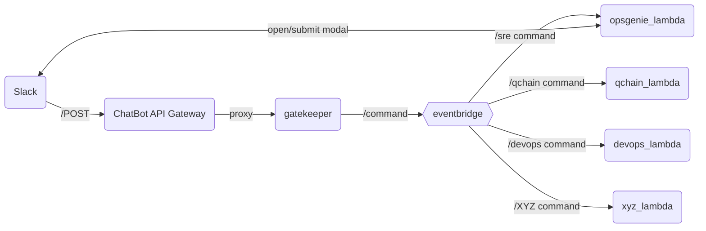
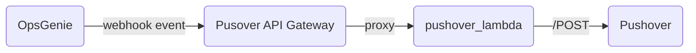

# Q-Bot

## Introduction
Q-Bot is a Slack chatbot that allows users to interact with infrastructure and services. It is built on AWS Lambda and API Gateway and is written in Python (but not limited to Python). It is designed to be extensible and easy to add new commands and integrations.

## Integration components
The folowing components are used in the solution design:
* Slack - workspace and Q-Bot slack application
* AWS API Gateway - Used by Slack to forward slash commands and interactivity events to Lambda
* AWS Lambda Gatekeeper - Used to authenticate Slack requests and forward to the appropriate Lambda via EventBridge
* AWS Lambda Backends - Used to process slash commands and interactivity events
* AWS EventBridge - Used to route events to the appropriate Lambda

### Chatbot component topology
A high level overview of the chatbot components and their interactions is shown below.

## Adding a new command & integration
Adding a new command and integration is a simple process. The following steps should be followed:
1. Create a new slash command in Slack and point the URL to the API Gateway endpoint
2. Add definitions to the gatekeeper lambda to authenticate the request: ALLOWED_CHANNELS and ALLOWED_COMMANDS
3. Create a new folder for you lambda function inside lambda/ and name it lambda_function.py
4. You may copy the boilerplate from example/backend_lambda/lambda_function.py
5. Create a lambda definition in the lambda.tf file
6. Add a new rule to the EventBridge to route the event to the appropriate lambda. EventBridge rules are defined in the lambda.tf file
7. Mark the lambda as non-production in Vanta. Coordinate with SecOps team on how to do this.

The Q-Bot application has to be invited into private channels, otherwise it will not be able to respond back to slack (Channel not found exception will be raised)

## Existing integrations

### /sre command
The /sre command is used to interact with OpsGenie. It is used to open incidents from Slack based on Service definitions defined in Opsgenie. The command is implemented in the opsgenie_lambda function. The function is triggered by an EventBridge rule that matches the /sre command. The function then parses the event and calls the appropriate OpsGenie API. The function is also used to open and submit the modal that is used to create new incidents. The modal is defined in the opsgenie_lambda function and is opened by the Slack client.

#### Pushover lambda 
The puhover lambda is a simple lambda that takes a webhook event from OpsGenie and sends a pushover notification to Pushover. It server as an example of how to integrate 3rd party services via API Gateway and Lambda. Should you copy this pattern, always use a method to authenticate against the Lambda or API Gateway to preven resource exhaustion. 

